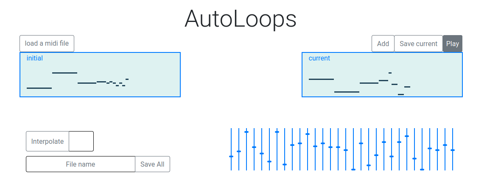
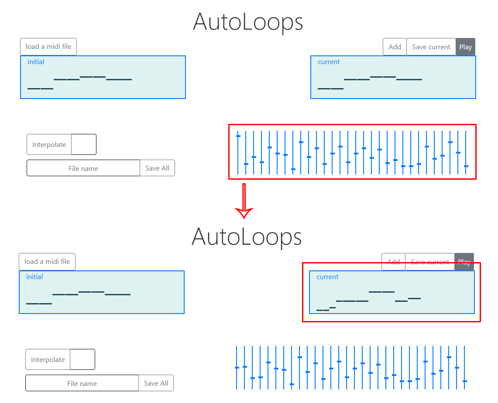
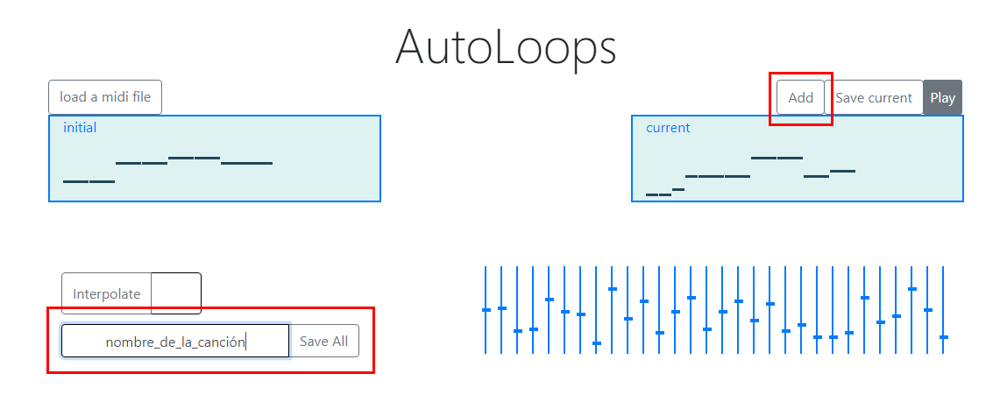
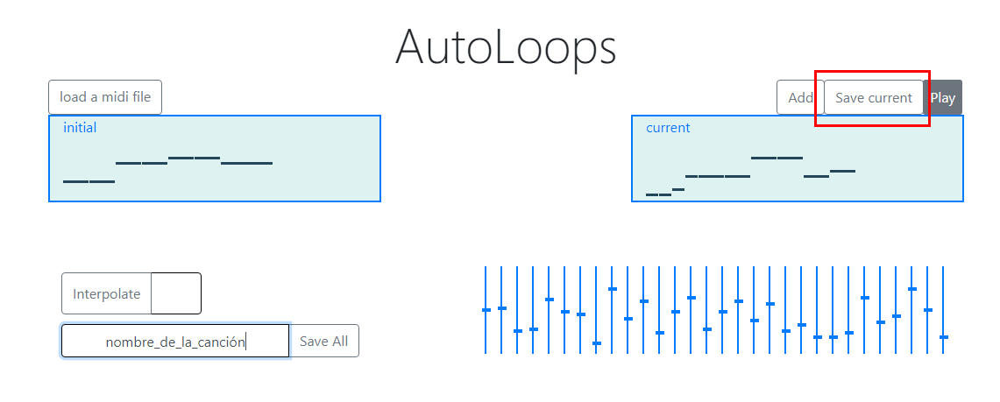

# AutoLoops

AutoLoops es una aplicación web para la generación de música usando [Magenta MusicVAE](https://magenta.tensorflow.org/music-vae). Para abrir la aplicación el usuario solo debe descargar los archivos y abrir _index.html_ con un navegador. Hecho esto se visualizará la interfaz.

Para comenzar a utilizar la herramienta el usuario deberá cargar una melodía en formato MIDI monofónica de dos compases. Esta acción puede llevarse a cabo mediante el botón _load a midi file_, que permitirá elegir el archivo sobre el que se quiere trabajar. Una vez la melodía ha sido introducida se mostrará en los cuadros _initial_ y _current_.

Una vez la melodía está cargada puede comenzarse a generar nuevas melodías a partir de la misma. Los controles deslizantes reflejarán las características en el espacio latente de la melodía que se ha cargado. El usuario puede modificarlas y con ello se generarán nuevas melodías. El cambio podrá apreciarse visualmente en el cuadro _current_, que mostrará la melodía correspondiente a la codificación actual marcada por los controles deslizantes. La melodía actual podrá también escucharse mediante el botón _play_.

Cada vez que el usuario lo considere oportuno puede utilizar el botón _add_ para guardar la melodía actual. Estas melodías guardadas podrán ser después exportadas como una secuencia completa mediante el botón _save all_, que también cuenta con un campo para recoger el nombre para el archivo MIDI en el que se exportarán las melodías.

También puede exportarse únicamente la melodía actual mediante el botón _save current_.

Por último se ofrece también la posibilidad de interpolar entre la melodía actual y la melodía inicial. Para ello se hará uso del botón _interpolate_, junto al que se incluye un campo para recoger el número de pasos que se quieren realizar. El usuario puede introducir un número y se guardará una interpolación entre la melodía de _textit_ y la de _initial_ con ese número de melodías, siendo la primera de la secuencia la melodía actual y la última la melodía inicial. Hecho esto la melodía inicial pasará a ser la actual y puede proseguirse con la utilización del programa.

